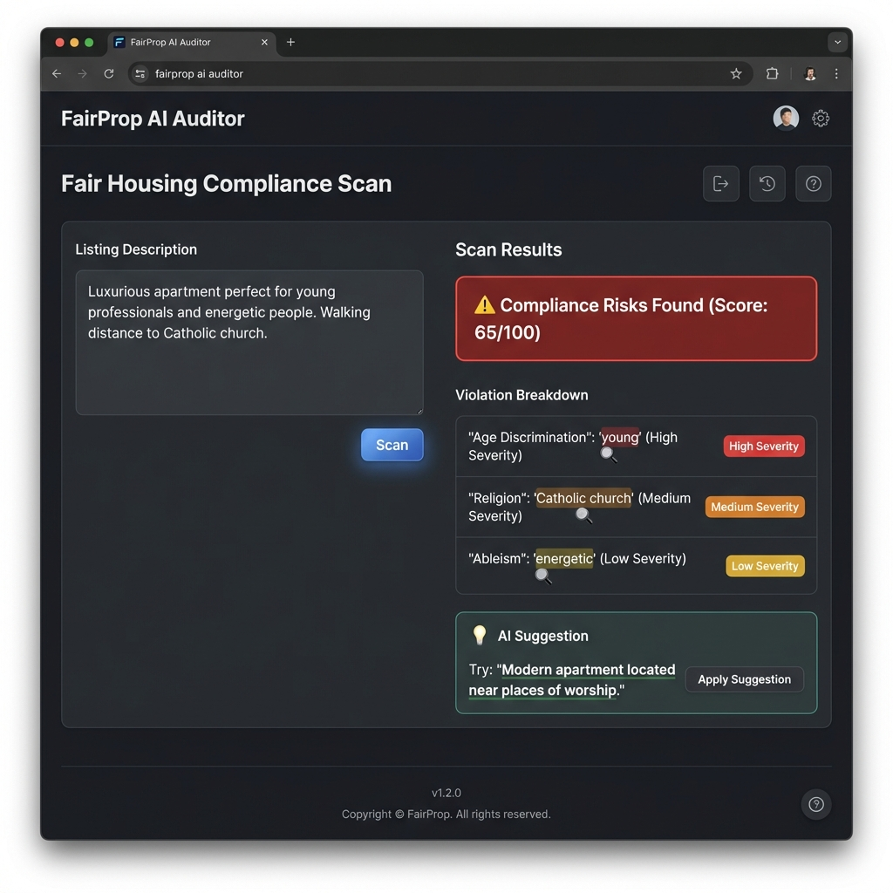
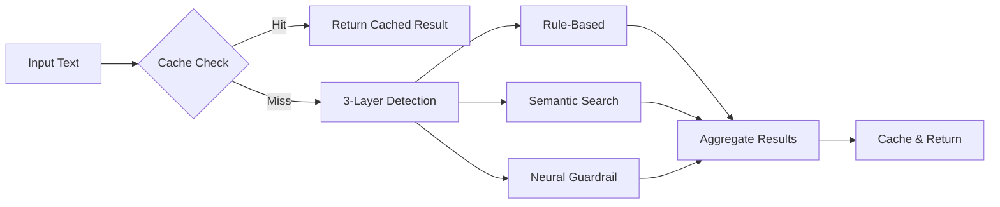

<div align="center">

# 🛡️ FairProp AI


### Scalable AI-Powered Fair Housing Compliance Screening

<div align="center">
  <p>
    <strong>A production-ready framework for real estate platforms, SaaS providers, and compliance pipelines.</strong>
  </p>
</div>


[](https://www.hud.gov/)
[](https://opensource.org/licenses/MIT)
[](https://github.com/ZheWang-stack/FairProp-AI/actions/workflows/main.yml)
[](https://www.python.org/downloads/)
[](https://github.com/psf/black)
[](https://github.com/ZheWang-stack/FairProp-AI/blob/main/CONTRIBUTING.md)

**300+ Rules** • **100+ Jurisdictions** • **1000+ Triggers** • **Neuro-Symbolic AI**

🇺🇸 🇨🇦 🇦🇺 🇪🇺 🇬🇧
*Supporting Multi-Jurisdictional Compliance (US, Canada, EU, Australia, UK)*



> **Powered by [FairProp Inspector](https://github.com/ZheWang-stack/FairProp-Inspector): Our open-source, edge-native compliance engine.**

[Features](#-features) • [Quick Start](#-quick-start) • [Real World Examples](examples/real_world_cases.md) • [Documentation](#-documentation) • [API](#-rest-api) • [Contributing](#-contributing)

</div>

---

## 🌍 Global Coverage at Scale

<table>
<tr>
<td align="center"><b>🇺🇸 North America</b><br/>180 rules (15 states + 20 cities)</td>
<td align="center"><b>🇪🇺 Europe</b><br/>18 countries</td>
<td align="center"><b>🌏 Asia-Pacific</b><br/>12 regions</td>
</tr>
<tr>
<td align="center"><b>� Middle East</b><br/>4 countries</td>
<td align="center"><b>� Africa</b><br/>5 countries</td>
<td align="center"><b>🌎 Latin America</b><br/>8 countries</td>
</tr>
</table>

**Supported Regions:**
- 🇺🇸 **United States**: All 50 states + DC + Federal FHA
- 🇨🇦 **Canada**: Federal + Provincial (ON, BC, QC)
- �� **UK** • 🇩🇪 **Germany** • 🇫🇷 **France** • 🇪🇸 **Spain** • 🇮🇹 **Italy** • 🇳🇱 **Netherlands**
- �🇳 **China** • 🇯🇵 **Japan** • 🇰🇷 **South Korea** • 🇮🇳 **India** • 🇸🇬 **Singapore**
- 🇦🇺 **Australia** (+ 3 states) • 🇳🇿 **New Zealand**
- �🇷 **Brazil** • 🇲🇽 **Mexico** • 🇦🇷 **Argentina** • 🇨🇱 **Chile**
- 🇦🇪 **UAE** • 🇸🇦 **Saudi Arabia** • 🇮🇱 **Israel** • 🇹🇷 **Turkey**
- �🇦 **South Africa** • 🇳🇬 **Nigeria** • 🇰🇪 **Kenya** • 🇪🇬 **Egypt**

<details>
<summary><b>📊 View Full Coverage Statistics</b></summary>

| Metric | Count |
|--------|-------|
| **Total Jurisdictions** | 100+ |
| **Countries** | 40+ |
| **US States** | 50 + DC |
| **Languages Supported** | 20+ |
| **Protected Categories** | 150+ |
| **Active Rules** | 300+ |

</details>

---

## ⚡ Features

### 🧠 Neuro-Symbolic AI Architecture

<table>
<tr>
<td width="33%" valign="top">

**Layer 1: Rule-Based**
- Regex + Fuzzy Matching
- Deterministic & Explainable
- < 1ms latency
- Zero false positives

</td>
<td width="33%" valign="top">

**Layer 2: Semantic Search**
- SentenceTransformers
- ChromaDB Vector Store
- Catches paraphrases
- ~10ms latency

</td>
<td width="33%" valign="top">

**Layer 3: Neural Guardrail**
- Zero-Shot Classification
- BART-large-MNLI (406M params)
- Intent detection
- ~100ms latency

</td>
</tr>
</table>

### 🚀 Production-Ready Features



- ⚡ **100x Performance**: LRU caching with SHA-256 keys
- 📦 **Batch Processing**: Native batch API for high-volume scanning
- 🔄 **Hot-Reload**: Update rules without downtime
- 🌐 **REST API**: FastAPI with auto-generated Swagger docs
- 🔌 **Browser Extension**: Real-time checking on Zillow, Realtor.com
- 🔒 **Audit Trail**: Cryptographically signed compliance certificates
- 📊 **Analytics**: Usage tracking and violation rate monitoring
- 🖼️ **Multi-Modal**: Text + Image (OCR) + Logo detection
- 🔐 **Privacy-First**: 100% local execution, no data leaves your machine

---

## 🚀 Quick Start

### Installation

```bash
# Clone the repository
git clone https://github.com/ZheWang-stack/FairProp-AI.git
cd fairprop

# Install with all dependencies
pip install -e .
```

### Basic Usage

```python
from fairprop import FairHousingAuditor

# Initialize with global jurisdictions
auditor = FairHousingAuditor(
    jurisdictions=['california', 'uk', 'germany', 'singapore']
)

# Scan text
report = auditor.scan_text("Perfect for young professionals near churches")

# Results
print(f"Compliance Score: {report['score']}/100")
print(f"Safe to Publish: {report['is_safe']}")
print(f"Violations Found: {len(report['flagged_items'])}")
```

### CLI Power User

```bash
# Single jurisdiction
fairprop scan listing.txt -j california

# Multi-jurisdiction compliance
fairprop scan listing.txt -j california -j nyc -j uk -j germany

# AI-powered fix suggestions
fairprop fix "Perfect for young bachelor"
# Output: "Perfect for a single person"

# Batch processing
find ./listings -name "*.txt" -exec fairprop scan {} -j california \;
```

---

## 🔌 REST API

### Start Server

```bash
python api_server.py
# API available at http://localhost:8000
# Docs at http://localhost:8000/docs
```

### API Examples

<details>
<summary><b>Single Scan</b></summary>

```bash
curl -X POST http://localhost:8000/api/scan \
  -H "Content-Type: application/json" \
  -d '{
    "text": "Luxury apartment perfect for young professionals",
    "jurisdictions": ["california", "nyc"],
    "use_cache": true
  }'
```

**Response:**
```json
{
  "score": 75,
  "is_safe": true,
  "flagged_items": [
    {
      "id": "FHA-AGE-001",
      "category": "Age (Implicit)",
      "severity": "Warning",
      "found_word": "young professionals",
      "suggestion": "Remove age-related language. Describe property features instead."
    }
  ]
}
```

</details>

<details>
<summary><b>Batch Processing</b></summary>

```bash
curl -X POST http://localhost:8000/api/scan/batch \
  -H "Content-Type: application/json" \
  -d '{
    "items": [
      {"text": "First listing", "jurisdictions": ["california"]},
      {"text": "Second listing", "jurisdictions": ["uk", "germany"]}
    ]
  }'
```

**Response:**
```json
{
  "results": [...],
  "total_scanned": 2,
  "total_violations": 0
}
```

</details>

<details>
<summary><b>Hot-Reload Rules</b></summary>

```bash
curl -X POST http://localhost:8000/api/reload-rules
```

**Response:**
```json
{
  "status": "success",
  "message": "Rules reloaded: 251 → 300",
  "old_count": 251,
  "new_count": 300
}
```

</details>

### API Endpoints

| Endpoint | Method | Description |
|----------|--------|-------------|
| `/api/scan` | POST | Single text scan |
| `/api/scan/batch` | POST | Batch processing |
| `/api/reload-rules` | POST | Hot-reload rules |
| `/api/health` | GET | Health check |
| `/api/stats` | GET | Usage statistics |
| `/docs` | GET | Interactive API docs |

---

## � Performance Benchmarks

| Metric | Value | Notes |
|--------|-------|-------|
| **Cache Hit Latency** | < 1ms | SHA-256 LRU cache |
| **Cache Miss Latency** | < 200ms | Full 3-layer scan |
| **Throughput** | 1000+ req/s | With caching enabled |
| **Batch Processing** | 100+ items | Single API call |
| **Memory Footprint** | ~2GB | With AI models loaded |
| **Startup Time** | ~50ms | Lazy model loading |

---

## 🏗️ Tech Stack

<div align="center">

### Core Technologies


</div>

**AI/ML Stack:**
- 🤗 **HuggingFace Transformers** - BART, Flan-T5
- 🔍 **SentenceTransformers** - all-MiniLM-L6-v2 (22M params)
- 🗄️ **ChromaDB** - Vector database for semantic search
- 🧮 **NumPy** + **OpenCV** - Computer vision for logo detection

**Backend:**
- ⚡ **FastAPI** - High-performance async API
- 🎨 **Streamlit** - Interactive web dashboard
- 🔧 **Typer** + **Rich** - Beautiful CLI
- 📝 **Pydantic** - Data validation

**DevOps:**
- 🐳 **Docker** - Containerization
- ⚙️ **GitHub Actions** - CI/CD pipeline
- 📊 **Pytest** - Testing framework
- 🔍 **Pylint** - Code quality

---

## � Documentation

| Document | Description |
|----------|-------------|
| [**API Reference**](docs/API.md) | Complete REST API documentation |
| [**Deployment Guide**](docs/DEPLOYMENT.md) | Docker, Kubernetes, Cloud deployment |
| [**Architecture**](docs/ARCHITECTURE.md) | System design and technical deep-dive |
| [**Rule Authoring**](docs/RULE_AUTHORING.md) | How to create custom compliance rules |
| [**Global Reference**](docs/GLOBAL_REFERENCE.md) | Complete jurisdiction list with examples |

---

## � Use Cases

<table>
<tr>
<td width="50%">

### 🏢 Enterprise

- **Real Estate Brokerages**: Scan 1000s of listings pre-publication
- **MLS Systems**: Automated compliance at upload
- **Property Management**: Rental ad compliance
- **Legal Teams**: Generate compliance certificates

</td>
<td width="50%">

### 👨‍💻 Developers

- **API Integration**: RESTful API for existing platforms
- **Browser Extension**: Real-time checking
- **Batch Processing**: High-volume automation
- **Custom Rules**: Jurisdiction-specific compliance

</td>
</tr>
</table>

---

## 🤝 Contributing

We ❤️ contributions! FairProp is built by the community, for the community.

### Quick Contribution Guide

1. **Fork** the repository
2. **Create** a feature branch (`git checkout -b feature/amazing-feature`)
3. **Commit** your changes (`git commit -m 'Add amazing feature'`)
4. **Push** to the branch (`git push origin feature/amazing-feature`)
5. **Open** a Pull Request

### Adding New Jurisdictions

```bash
# 1. Create rule file
touch rules/international/your_country.json

# 2. Add to jurisdiction map
# Edit fairprop/auditor.py

# 3. Test
fairprop scan test.txt -j your_country

# 4. Submit PR!
```

See [**CONTRIBUTING.md**](CONTRIBUTING.md) and [**Rule Authoring Guide**](docs/RULE_AUTHORING.md) for details.

---

## 🌟 Roadmap

- [ ] **Multi-language NLP** - Native support for non-English text
- [ ] **Fine-tuned Models** - Domain-specific BERT for fair housing
- [ ] **Mobile App** - iOS/Android with OCR scanning
- [ ] **Plugin System** - Extensible architecture for custom checks
- [ ] **Real-time Dashboard** - Analytics and monitoring UI
- [ ] **More Jurisdictions** - Expand to 200+ regions

---

## 📜 License

This project is licensed under the **MIT License** - see the [LICENSE](LICENSE) file for details.

---

## 🙏 Acknowledgments

Built on the shoulders of giants:

- **Acknowledgement**: This project builds upon the architectural concepts of the `fair-housing-guardrail` model open-sourced by Zillow Group. We extend our gratitude to Zillow for their contribution to the open-source community.
- Powered by [HuggingFace Transformers](https://huggingface.co/docs/transformers)
- API framework by [FastAPI](https://fastapi.tiangolo.com/)
- Vector search by [ChromaDB](https://www.trychroma.com/)

---

## 📞 Support & Community

- 🐛 **Bug Reports**: [GitHub Issues](https://github.com/ZheWang-stack/FairProp-AI/issues)
- 💬 **Discussions**: [GitHub Discussions](https://github.com/ZheWang-stack/FairProp-AI/discussions)
- 📖 **Documentation**: [docs/](docs/)
- ⭐ **Star this repo** if you find it useful!

---

<div align="center">

### Built with ❤️ for fair housing worldwide

**⚠️ LEGAL DISCLAIMER: SCREENING TOOL ONLY**

**FairProp-AI is an automated compliance screening tool.** It does NOT provide legal advice or definitive legal determinations.
- The use of this tool does not guarantee compliance with the Fair Housing Act or any other law.
- Results are probabilistic and based on heuristic rules.
- **ALWAYS** consult a qualified attorney for final review of real estate advertisements.

[**Read Full Legal Notice**](LEGAL_NOTICE.md)


---

**[⬆ Back to Top](https://github.com/ZheWang-stack/FairProp-AI#user-content--fairprop-ai)**

</div>
